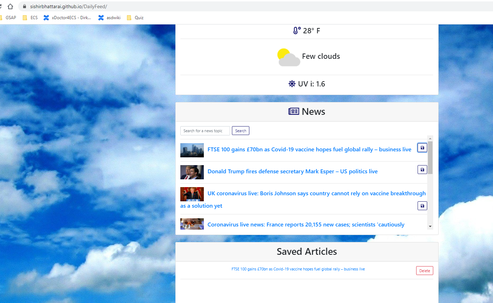
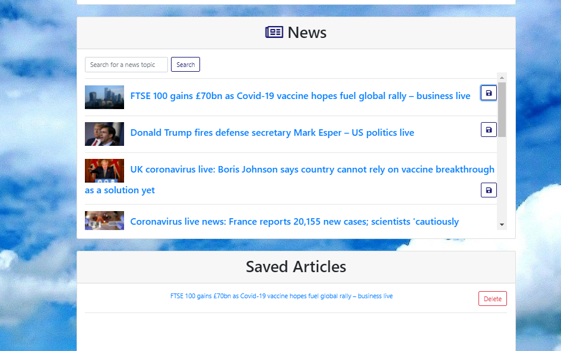

# Live Deployed Site:

 https://sishirbhattarai.github.io/DailyFeed/

# User Story

As a user, I need an app which shows current local weather as well as any latest news on searching all in one page.
As a user, I want to save news if needed.
As a user, I want to delete saved news once read.

# Technology Used:
-HTML, CSS, JScript, JQUERY
- This project features MapQuestAPI, GuardianAPI, and WeatherBit API to get the best relevant news and the weather. This will be a breakfast companion-esq app.

# Test:
-User allow browser to use the current geo-location.

- User can click save button to save the news
  

- User can also delete button to delete news after saving it.
  

# Contributors:

Name: Sishir Bhattarai (sishir.bhattarai@outlook.com), Jack Kempton (jckkempton@gmail.com), Jeffrey Woods (jeffreytwoods2@icloud.com)
