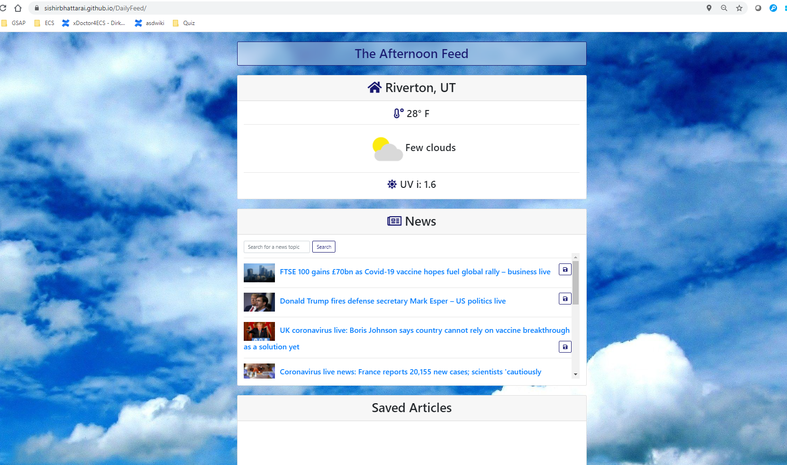

Daily Feed

- This project will feature MapQuestAPI, GuardianAPI, and WeatherBit API to get the best relevant news and the weather. This will be a breakfast companion-esq app.

- As a traveller, I want to read the local news, and get the latest weather update all in one page.

Site is published at https://sishirbhattarai.github.io/DailyFeed/

-User allow browser to use the current geo-location.

- User can click save button to save the news
  

- User can also delete button to delete news after saving it.
  
